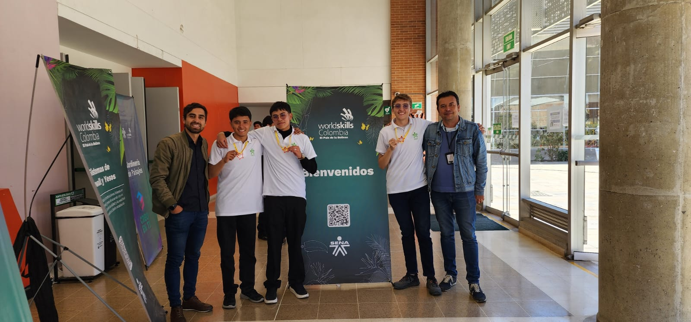
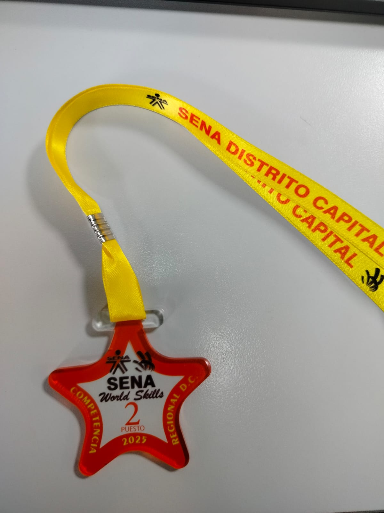
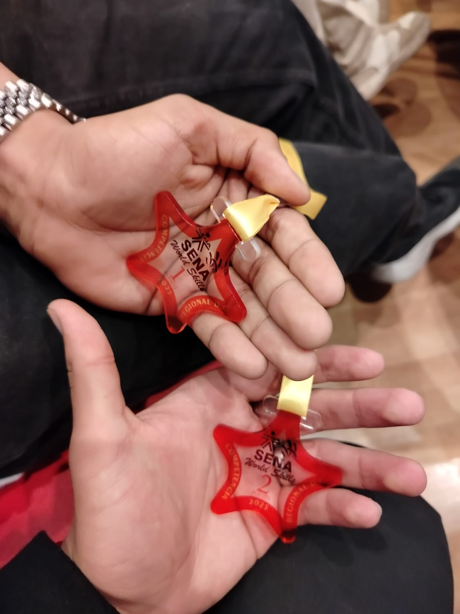

# 🏆 WorldSkills Bogotá Distrito Capital 2025 – 🥈 Plata Regional en Tecnologías Web

En este repositorio conservo todo el proceso y trabajo realizado durante mi participación en la competencia regional WorldSkills Bogotá 2025, en la Habilidad 17: Tecnologías Web. Representé al CEET del SENA con dedicación y esfuerzo, y obtuve el segundo puesto a nivel regional en una de las categorías más exigentes y con mayor número de participantes.
Aquí se encuentra el desarrollo técnico presentado, junto con recursos utilizados, tareas entregadas y evidencias visuales como fotografías de la competencia y la ceremonia de premiación. Este espacio refleja el compromiso, aprendizaje constante y pasión por la tecnología que marqué en cada etapa del reto.

---

## 🏅 ¿Qué son las WorldSkills y por qué son importantes?
WorldSkills es una organización internacional que promueve la excelencia en habilidades técnicas y tecnológicas a través de competencias de alto nivel entre jóvenes de todo el mundo. Las competencias WorldSkills permiten demostrar capacidades profesionales en entornos reales, bajo presión, y frente a estándares internacionales.

Participar en WorldSkills es una experiencia altamente valorada porque:

💡 Desarrolla habilidades técnicas de nivel avanzado.

🧠 Fomenta la resolución de problemas reales con soluciones innovadoras.

🤝 Impulsa el trabajo en equipo, la disciplina y la adaptabilidad.

🌍 Ofrece visibilidad nacional e internacional a talentos jóvenes.

🥇 Es una plataforma reconocida por empleadores, instituciones educativas y líderes del sector productivo.

Obtener un segundo puesto a nivel regional, como en este caso, no solo demuestra dominio técnico, sino también compromiso, dedicación y potencial profesional.

## 🚀 Tecnologías utilizadas

- ⚙️ Laravel (Backend)
- ⚛️ React (Frontend)
- 🌐 HTML5
- 🎨 CSS3
- 🧠 JavaScript Nativo

## 📸 Evidencia de logros obtenidos

### 🔹 Participación en la competencia

  
   
  <em>Medalla por obtener el segundo puesto regional</em>

  
   
  <em>Ceremonia de cierre y premiacion</em>

### 🥈 Premiación y medalla

  
   
  <em>Medalla de primer y segundo puesto obtenidas en la competencia regional</em>

---

## 🎯 Competencia

### 🟪 Módulo A – Desarrollo Frontend (Día 1)

Este módulo estuvo enfocado en el desarrollo web del lado del cliente, abarcando los siguientes temas:

- ✅ JavaScript en nivel básico e intermedio  
- ✅ Estructura y buenas prácticas con HTML  
- ✅ Estilización con CSS básico e intermedio  
- ✅ Diseño responsivo y maquetación adaptable  
- ✅ Animaciones avanzadas con CSS  
- ✅ Uso de sprites y optimización de imágenes  

[🔍 Ver Módulo A](#)

---

### 🟨 Módulo B – Desarrollo Backend (Día 2)

Este módulo evaluó las competencias en programación del lado del servidor y el desarrollo full-stack, incluyendo:

- ⚙️ Desarrollo backend con Laravel  
- 🗄️ Gestión de base de datos con migraciones y Eloquent  
- 🔁 Construcción de una API REST para manejo de datos  
- ⚛️ Implementación de componentes interactivos con React  

[🔍 Ver Módulo B](#)

## 📩Contactame

Puedes encontrarme o escribirme a través de estos medios:

**Diego Alejandro Paloma Díaz**  
💼 LinkedIn: [Diego Alejandro Paloma](https://www.linkedin.com/in/paloma-el-mejor-ab4008308/)  
💻 GitHub: [@diegopaloma](https://github.com/Diegoalejandro17/DiegoAlejandroPalomaDiaz)   
📧 Correo: diegoalejandropalomadiaz576@gmail.com 

